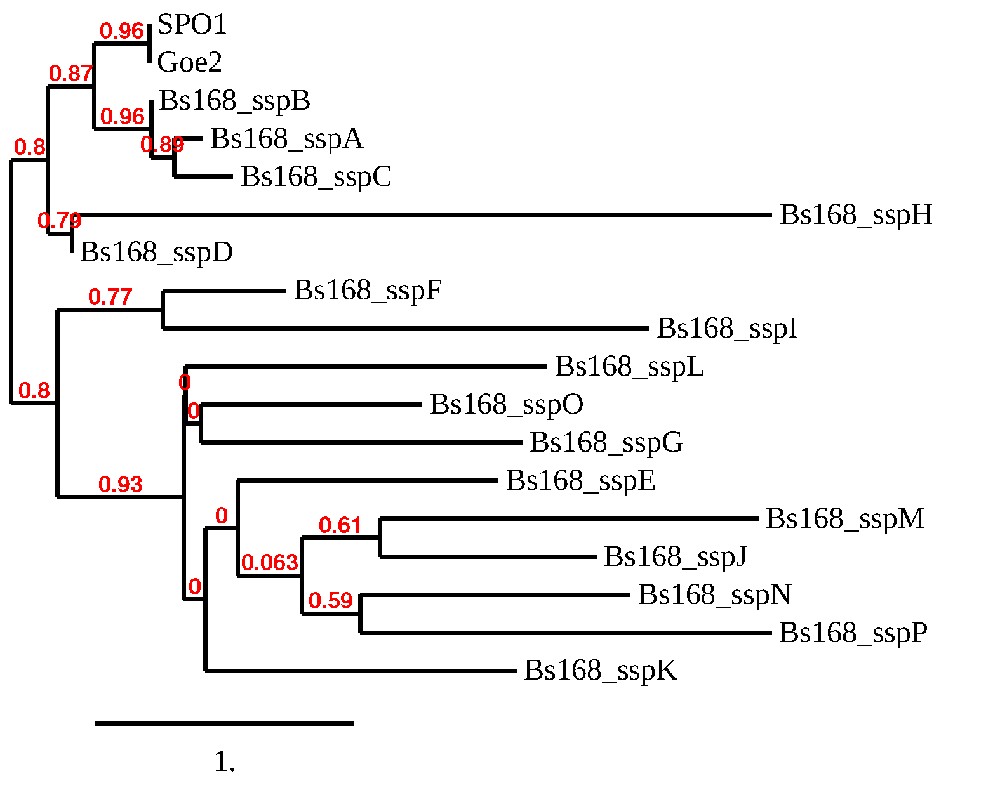

*Chian Jung Chen, Daniel Schwartz and Jay Lennon*

In the host-phage interaction, when infecting cells undergoing sporulation, phage genomes can get entrapped in dormant cells (i.e., viral spores) and start infection upon spore germination.
Past research found that some homologs of bacteria sporulation genes were carried by phages. However, the reason why phages carry these genes is still unknown. One of these homologs is the *ssp* gene, which encodes for small acid-soluble spore proteins (SASP). SASPs are double-stranded DNA-binding proteins that change the conformation of DNA, protecting the spore from heat, UV radiation, and enzymatic degradation.  

In Bacillus subtilis there are 16 *ssp* paralogs (*sspA*...*sspP*), however spore protection is mediated almost entirely by the 2 major SASPs encoded by *sspA* and *sspB*. The *ssp* homologs found in phages SPO1 and Goe2 are most similar to the major *ssp* genes.  


  
   
**AA alignment phylogeny by phylogeny.fr**

A double knockout B. subtilis strain $\Delta sspAB$ sporulates like the Wild-type (WT), but the spores made have reduced heat resistance (Mason and Setlow 1986 JBac 167:174). 


Based on the host function of the homolog and phage entrapment properties, we hypothesized that phage *ssp* homologs promote spore heat resistance and will help restore heat resistance of spores made by $\Delta sspAB$.


```{r setup,  echo=FALSE, message=FALSE, warning=FALSE}
library(renv)
library(tidyverse, quietly = T)
library(broom)
library(cowplot, quietly = T)
library(here)
library(ggrepel)
library(scales)
# set_here("../")
knitr::opts_chunk$set(fig.width=10, fig.height=7,fig.align="center")
```


```{r read in data,  echo=FALSE, message=FALSE, warning=FALSE}
d <- read_csv(here("data","ssp_data.csv"))%>%
  mutate(group=str_replace(group, "group.","g"))
```

## Preliminary test of spore heat-resistance

We obtained the $\Delta sspAB$, $\Delta sspC$ and $\Delta sspD$ strains from the BGSC and tested the heat resistance of their spores alongside the B. subtilis 168 WT.For this strains were allowed to sporulate for 2 days in DSM before spores were purified. Spores were then subjected to heat treatment at $90 ^\circ C$ and plated to estimate viable spores from CFU counts. Spore survival data below is presented ad fraction survivors relative to non treated sample (t=0).

```{r prelim host plot, message=FALSE, warning=FALSE}
d%>%
  mutate(host=fct_rev(host))%>%
  filter(!filter)%>%
  filter(date==20200118)%>%
  #there are 4 rows with data marked as "TMC" (=Too Many to Count) 
  # these are coerced into NA
  mutate(counts=as.numeric(counts ))%>%
  mutate(no.ml = counts/(dilution*ml.plated))%>%
  # group_by(host)%>%
  mutate(perc = no.ml/no.ml[heat.min==0])%>%
  ggplot(aes(x=heat.min, y=perc))+
    # geom_smooth(aes(color=host),method = "lm", se=F, size=2)+
    geom_line(aes(color=host), size=2)+
    geom_point(aes(color=host),size=4, shape=21, fill="white")+
    geom_text_repel(data=.%>%filter(heat.min>35),aes(label=perc%>%round(digits = 2)))+
  scale_y_log10()+
  theme_cowplot()+
  ylab("viable spore fraction (log)")+
  xlab("Time at 90dC (min)")
```

The largest reduction in heat resistance was seen in $\Delta sspAB$, and it is with this strain that we proceeded to the next step.

## Preliminary spore resistance test with phage

To test if phages carrying *ssp* homologs may restore the heat resistance when infecting a host with reduced resistance, $\Delta sspAB$ were induced to sporulate, as described above, but were infected with phage at the onset of sporulation. After 2 days spores were purified and subjected to heat resistance test. Since infected cultures contain both regular spores and viral-spores (due to entrapment) spore viability in during heat treatment was measured by plating for both colony and plaque forming units and these results are presented separately. As controls spores from non-infected WT and $\Delta sspAB$ were also tested by CFU plating. 

```{r prelim phage plot,  message=FALSE, warning=FALSE}
d%>%
  mutate(phage=fct_relevel(phage,c("noPhage","Goe2", "SPO1")))%>%
  mutate(host=fct_rev(host))%>%
  filter(host=="wt"|host=="dsspAB")%>%
  filter(date!=20200118)%>%
  filter(!filter)%>%
  filter(group=="preliminary")%>%
  #there are 4 rows with data marked as "TMC" (=Too Many to Count) 
  # these are coerced into NA
  mutate(counts=as.numeric(counts ))%>%
  mutate(no.ml = counts/(dilution*ml.plated))%>%
  group_by(host,phage,assay, date)%>%
  mutate(perc = no.ml/no.ml[heat.min==0])%>%
  ggplot(aes(x=heat.min, y=perc))+
    geom_line(aes(group=interaction(date,assay, host),color=phage, linetype=assay), size=2)+
    geom_point(aes(group=interaction(date,assay, host),color=phage, shape=assay), size=3, fill="white")+
  scale_y_log10()+
  scale_shape_manual(values = c(21,24))+
      geom_text_repel(data=.%>%filter(heat.min>35),aes(x=heat.min+2,label=perc%>%round(digits = 4),color=phage), xlim = c(40, NA) )+
    geom_text_repel(data=.%>%filter(heat.min>35 & phage=="noPhage"),aes(label=host),size=5,xlim = c(NA,35), ylim = c(NA,log10(0.5)))+
  theme_cowplot()+
  panel_border()+
  ylab("viable spore fraction (log)")+
  xlab("Time at 90dC (min)")+
  xlim(0,45)
```

In this preliminary experiment we observed that infection by Goe2 phage partially restored the spore resistance of the $\Delta sspAB$ for both types of spores, Infection by SPO1 completely restored spore resistance of colony forming spores but not of viral spores. Encouraged, though slightly confused by these data (how could viruses affect non-viral spores?) we next proceeded to conduct a similar experiment with replication.

## Replicated spore resistance assay  
In this experiment both the WT and $\Delta sspAB$ strains were induced to sporulate in DSM. At the onset of sporulation each of the cultures were infected (MOI=3) with either phage SPO1, phage Goe2 , or with no phage as a control. after 2 days spores were purified and subjected to heat resistance test where both CFU and PFU were measured, following regular and viral spores, respectively.  
The experiment had replication of n=3. where the sporulation and infection assays were all done together. Purified spores were then stored in the fridge. The heat resistance tests were then conducted in 3 groups, on separate days, each consisting of all treatments at n=1. Samples were plated before heat treatment (t=0) and after 15,30 and 45 min of heat treatment.    
To make sure we were looking at heat response of viral spores, and not free viruses, samples of the purified spores were filtered and plaque assayed to measure the levels of free phages (spores exclude by filter while free phages pass through).

```{r filter plot,  echo=FALSE, message=FALSE, warning=FALSE}
d%>%
  mutate(phage=fct_relevel(phage,c("noPhage","Goe2", "SPO1")))%>%
  mutate(host=fct_rev(host))%>%
  filter(host=="wt"|host=="dsspAB")%>%
  filter(group!="preliminary")%>%
  filter(heat.min==0)%>%
  filter(assay=="PFU")%>%
  #there are 4 rows with data marked as "TMC" (=Too Many to Count) 
  # these are coerced into NA
  mutate(counts=as.numeric(counts))%>%
  mutate(no.ml = counts/(dilution*ml.plated))%>%
  pivot_wider(id_cols = c("host","phage","group"), names_from="filter", values_from="no.ml")%>%
  rename(free.phage=`TRUE`, total=`FALSE`)%>%
    mutate(perc.free=percent(free.phage/total))%>%
  ggplot(aes(x=group))+
  geom_point(data = .%>%pivot_longer(c("total", "free.phage"),names_to="pop" , values_to="PFU.ml"), aes(y=PFU.ml, color=pop, shape=pop),size=2)+
  geom_text(aes(label=perc.free, y=free.phage/4))+
  scale_y_log10()+
  facet_grid(phage~host)+
  theme_cowplot()+
  scale_shape_manual(values = c(21,24))+
  panel_border()+
  ylab("PFU/ml")+
  ggtitle("PFU source of untreated samples (t=0)")
```

```{r filter sum plot,  echo=FALSE, message=FALSE, warning=FALSE}
d.filt <- d%>%
  mutate(phage=fct_relevel(phage,c("noPhage","Goe2", "SPO1")))%>%
  mutate(host=fct_rev(host))%>%
  filter(host=="wt"|host=="dsspAB")%>%
  filter(group!="preliminary")%>%
  filter(heat.min==0)%>%
  filter(assay=="PFU")%>%
  #there are 4 rows with data marked as "TMC" (=Too Many to Count) 
  # these are coerced into NA
  mutate(counts=as.numeric(counts))%>%
  mutate(no.ml = counts/(dilution*ml.plated))%>%
  pivot_wider(id_cols = c("host","phage","group"), names_from="filter", values_from="no.ml")%>%
  rename(free.phage=`TRUE`, total=`FALSE`)%>%
    mutate(perc.free=100*free.phage/total)

sum.filt <- d.filt%>%
  filter(!is.na(perc.free))%>%
  group_by(phage,host)%>%
  summarise(n=n(),m=mean(perc.free), s=sd(perc.free))

d.filt%>%
  ggplot(aes(x=host,y= perc.free))+
  geom_col(data=sum.filt,aes(y=m))+
  geom_text(data=sum.filt,aes(label=percent(m/100)), y=10)+
  geom_jitter(width = 0.1, height = 0, shape=21, size=3, fill="white")+
  coord_cartesian(ylim=c(1e-5,100))+
  facet_wrap(~phage)+
  theme_cowplot()+
  scale_shape_manual(values = c(21,24))+
  panel_border()+
  ylab("Free phage (%)")+
  ggsave2(here("figures", "filter_phage.png"),width = 4,height = 4)


```

In all cases measured the free phages were only a small fraction of the total PFU, being 1.1% or lower. Therefore, we can attribute any PFU decline observed in heat treatment to the change in spore viability. For 3 samples (all in group.1) the filtered sample plating was not sufficiently diluted for enumeration.


Next we present the change in titer during heat treatment, normalized to t=0.  

Looking first at non-infected controls:
```{r replicated ctrl plot,  echo=FALSE, message=FALSE, warning=FALSE}
d%>%
  mutate(phage=fct_relevel(phage,c("noPhage","Goe2", "SPO1")))%>%
  mutate(host=fct_rev(host))%>%
  filter(host=="wt"|host=="dsspAB")%>%
  filter(!filter)%>%
  filter(group!="preliminary")%>%
  filter(phage=="noPhage")%>%
  #there are 4 rows with data marked as "TMC" (=Too Many to Count) 
  # these are coerced into NA
  mutate(counts=as.numeric(counts ))%>%
  mutate(no.ml = counts/(dilution*ml.plated))%>%
  group_by(host,phage,assay, group)%>%
  mutate(perc = 100*no.ml/no.ml[heat.min==0])%>%
  ungroup()%>%
  mutate(g=interaction(group,host))%>%
  ggplot(aes(x=heat.min, y=perc))+
    geom_line(aes(group=g,color=host),size=1)+
    geom_point(aes(group=g,color=host),shape=21, size=3, fill="white")+
  coord_cartesian(ylim=c(1,130))+
  scale_y_log10(breaks=c(100,10,1))+
  theme_cowplot()+
  # panel_border()+
  ylab("Survival percent (log)")+
  xlab("Time at 90dC (min)")+
  scale_x_continuous(breaks = c(0,15,30,45))+
  theme(legend.position = "bottom")+
  ggsave2(here("figures", "noPhage_heatTreat.png"),width = 6,height = 6)
```

```{r replicated plot,  echo=FALSE, message=FALSE, warning=FALSE}
d%>%
  mutate(phage=fct_relevel(phage,c("noPhage","Goe2", "SPO1")))%>%
  mutate(host=fct_rev(host))%>%
  filter(host=="wt"|host=="dsspAB")%>%
  filter(!filter)%>%
  filter(group!="preliminary")%>%
  #there are 4 rows with data marked as "TMC" (=Too Many to Count) 
  # these are coerced into NA
  mutate(counts=as.numeric(counts ))%>%
  mutate(no.ml = counts/(dilution*ml.plated))%>%
  group_by(host,phage,assay, group)%>%
  mutate(perc = no.ml/no.ml[heat.min==0])%>%
  ggplot(aes(x=heat.min, y=perc))+
    geom_line(aes(color=assay, linetype=group),size=1)+
    geom_point(aes(color=assay, shape=group), size=1.5, fill="white")+
  scale_y_log10()+
  scale_shape_manual(values = c(21,23,24))+
    facet_grid(host~phage)+
  theme_cowplot()+
  panel_border()+
  ylab("viable spore fraction (log)")
```

Once again we see that, in the absence of phage, WT spore titer barely changes by heat treatment while the $\Delta sspAB$ strain titer drops by nearly 2 orders of magnitude. In most cases it is not obvious if the infection with phage alters that response. However spores produced in WT cultures infected with Goe2 appear less resistant in 2 of 3 replication groups, seen both in CFU and PFU (upper middle panel).  

```{r replicated plot nice,  echo=FALSE, message=FALSE, warning=FALSE}
d.rep <- d%>%
  mutate(phage=fct_relevel(phage,c("noPhage","Goe2", "SPO1")))%>%
  mutate(host=fct_rev(host))%>%
  filter(host=="wt"|host=="dsspAB")%>%
  filter(!filter)%>%
  filter(group!="preliminary")%>%
  mutate(counts=as.numeric(counts ))%>%
  mutate(no.ml = counts/(dilution*ml.plated))%>%
  group_by(host,phage,assay, group)%>%
  mutate(perc = 100*no.ml/no.ml[heat.min==0])


d.rep.inf <- 
  d.rep%>%
  filter(phage!="noPhage")%>%
  mutate(spore=if_else(assay=="CFU",
         "infected host spore","viral spore"))


#duplicate ctrl data to present in both phage panels
d.rep.ctrl1 <- 
  d.rep%>%
  filter(phage=="noPhage")%>%
  mutate(phage="SPO1")

d.rep.plot <- 
  d.rep%>%
  filter(phage=="noPhage")%>%
  mutate(phage="Goe2")%>%
  bind_rows(.,d.rep.ctrl1 )%>%
  mutate(spore="non-infected host spore")%>%
  #add infected data back in
  bind_rows(.,d.rep.inf )
    
d.rep.plot%>%
  mutate(spore=fct_relevel(spore,c("non-infected host spore","infected host spore","viral spore")))%>%
  ggplot(aes(x=heat.min, y=perc, color=spore))+
    geom_line(aes(group=interaction(host,phage,assay,group,spore)),size=1)+
    # geom_pointrange(aes(ymax=m+s, ymin=m-s), size=0.8,shape=21, fill="white")+
  scale_y_log10()+
  facet_grid(host~phage)+
  theme_cowplot()+
  panel_border()+
  xlab("Time at 90dC (min)")+
  ylab("Survival percent (log)")+
  # scale_color_manual(values = c("black", "red", "violet"))+
  scale_color_viridis_d()+
  scale_x_continuous(breaks = c(0,15,30,45))+
  theme(legend.position = "bottom")+
  ggsave2(here("figures", "replcated_heatTreat_ALL.png"),width = 6,height = 6)
```

```{r replicated sum plot,  echo=FALSE, message=FALSE, warning=FALSE}
d.rep <- d%>%
  mutate(phage=fct_relevel(phage,c("noPhage","Goe2", "SPO1")))%>%
  mutate(host=fct_rev(host))%>%
  filter(host=="wt"|host=="dsspAB")%>%
  filter(!filter)%>%
  filter(group!="preliminary")%>%
  mutate(counts=as.numeric(counts ))%>%
  mutate(no.ml = counts/(dilution*ml.plated))%>%
  group_by(host,phage,assay, group)%>%
  mutate(perc = 100*no.ml/no.ml[heat.min==0])

sum.rep <- d.rep%>%
  filter(!is.na(perc))%>%
  group_by(host,phage,assay, heat.min)%>%
  summarise(n=n(),m=mean(perc), s=sd(perc))
  
sum.rep.inf <- 
  sum.rep%>%
  filter(phage!="noPhage")%>%
  mutate(spore=if_else(assay=="CFU",
         "infected host spore","viral spore"))


#duplicate ctrl data to present in both phage panels
sum.rep.ctrl1 <- 
  sum.rep%>%
  filter(phage=="noPhage")%>%
  mutate(phage="SPO1")

sum.rep.plot <- 
  sum.rep%>%
  filter(phage=="noPhage")%>%
  mutate(phage="Goe2")%>%
  bind_rows(.,sum.rep.ctrl1 )%>%
  mutate(spore="non-infected host spore")%>%
  #add infected data back in
  bind_rows(.,sum.rep.inf )
    
p.decay <- sum.rep.plot%>%
  mutate(spore=fct_relevel(spore,c("non-infected host spore","infected host spore","viral spore")))%>%
  ggplot(aes(x=heat.min, y=m, color=spore))+
    geom_line(size=1)+
    geom_pointrange(aes(ymax=m+s, ymin=m-s), size=0.8,shape=21, fill="white")+
  scale_y_log10()+
  facet_grid(phage~host)+
  theme_cowplot()+
  panel_border()+
  xlab("Time at 90dC (min)")+
  ylab("Survival percent (log)")+
  # scale_color_manual(values = c("black", "red", "violet"))+
  scale_color_viridis_d()+
  scale_x_continuous(breaks = c(0,15,30,45))+
  theme(legend.position = "bottom",
        legend.title = element_blank())+
  guides(color=guide_legend(nrow=2,byrow=TRUE))

p.decay+
  ggsave2(here("figures", "replcated_heatTreat.png"),width = 6,height = 6)
```

## Comparing slopes  
To be able to compare the heat-resistance of different samples and treatments we next estimate the slope of each curve by fitting a linear model. The estimated parameters of the models are given in the following tables, where each line is a single parameter (see column `term`; `heat.min` is the slope).  

```{r slopes, echo=FALSE}
d.lm <- 
d%>%
  mutate(phage=fct_relevel(phage,c("noPhage","Goe2", "SPO1")))%>%
  mutate(host=fct_rev(host))%>%
  filter(host=="wt"|host=="dsspAB")%>%
  filter(!filter)%>%
  filter(group!="preliminary")%>%
  #there are 4 rows with data marked as "TMC" (=Too Many to Count) 
  # these are coerced into NA
  mutate(counts=as.numeric(counts ))%>%
  mutate(no.ml = counts/(dilution*ml.plated))%>%
  group_by(host,phage,assay, group)%>%
  mutate(perc = no.ml/no.ml[heat.min==0])

d.lm.fit <- 
  d.lm%>%
   do(glance(lm(perc~heat.min,.)))
# values returned by glance:
# r.squared: The percent of variance explained by the model
# adj.r.squared: r.squared adjusted based on the degrees of freedom
# sigma: The square root of the estimated residual variance
# statistic: F-statistic
# p.value: p-value from the F test, describing whether the full regression is significant
# df: Degrees of freedom used by the coefficients
# logLik: the data's log-likelihood under the model
# AIC: the Akaike Information Criterion
# BIC: the Bayesian Information Criterion
# deviance: deviance
# df.residual: residual degrees of freedom

d.lm <- 
  d.lm%>%
   do(tidy(lm(perc~heat.min,.)))
 
  d.lm.estimates <- 
    d.lm%>%
    select(host,phage,assay,group,term,estimate)%>%
    pivot_wider(names_from = term, values_from = estimate)%>%
    rename(slope=heat.min, intercept=`(Intercept)`)
  
  
  d.slopes <- 
    filter(d.lm,term=="heat.min")%>%
    #add spore type 
    mutate(spore=case_when(assay=="PFU" ~ "viral spore",
                           phage=="noPhage" ~ "non-infected host spore",
                           TRUE ~ "infected host spore"))%>%
    mutate(spore=fct_relevel(spore,c("non-infected host spore","infected host spore","viral spore")))
    
  
  d.lm
```

# plot estimated slopes  
Next we plot the predicted linear models to see if they are in agreement with measured points.  

```{r plot slopes, echo=FALSE}
d%>%
  mutate(phage=fct_relevel(phage,c("noPhage","Goe2", "SPO1")))%>%
  mutate(host=fct_rev(host))%>%
  filter(host=="wt"|host=="dsspAB")%>%
  filter(!filter)%>%
  filter(group!="preliminary")%>%
  #there are 4 rows with data marked as "TMC" (=Too Many to Count) 
  # these are coerced into NA
  mutate(counts=as.numeric(counts ))%>%
  mutate(no.ml = counts/(dilution*ml.plated))%>%
  group_by(host,phage,assay, group)%>%
  mutate(perc = no.ml/no.ml[heat.min==0])%>%
  ggplot(aes(x=heat.min, y=perc))+
    geom_abline(data=d.lm.estimates,
                aes(slope=slope, intercept=intercept,
                    color=phage, linetype=assay),size=1)+
    geom_point(aes(color=phage, shape=assay), size=2, fill="white")+
    geom_text(data=d.lm.fit%>%
                  mutate(xr2=ifelse(host=="wt",10,30))%>%
                  mutate(yr2=ifelse(host=="wt",0.2,1)),
  aes(label=round(r.squared,2), x=xr2, y=yr2))+
  scale_shape_manual(values = c(21,24))+
    facet_grid(assay+group~host+phage)+
  theme_cowplot()+
  panel_border()+
  ylab("viable spore fraction")+
  labs(caption = "Value in each plot is the R-squared")+
  theme(plot.caption = element_text(hjust = 0))
```

Overall the linear model plots seem to capture the trend of the data. I am not sure how much to make of it but the p-values given for the parameters are not very low. This can be seen in the plot below for the slope. I still need to find what this all means about the ability to use slope data. 

```{r plot slope pvals, echo=FALSE}
d%>%
  mutate(phage=fct_relevel(phage,c("noPhage","Goe2", "SPO1")))%>%
  mutate(host=fct_rev(host))%>%
  filter(host=="wt"|host=="dsspAB")%>%
  filter(!filter)%>%
  filter(group!="preliminary")%>%
  #there are 4 rows with data marked as "TMC" (=Too Many to Count) 
  # these are coerced into NA
  mutate(counts=as.numeric(counts ))%>%
  mutate(no.ml = counts/(dilution*ml.plated))%>%
  group_by(host,phage,assay, group)%>%
  mutate(perc = no.ml/no.ml[heat.min==0])%>%
  ggplot(aes(x=heat.min, y=perc))+
    geom_abline(data=d.lm.estimates,
                aes(slope=slope, intercept=intercept,
                    color=phage, linetype=assay),size=1)+
    geom_point(aes(color=phage, shape=assay), size=2, fill="white")+
    geom_text(data=d.lm%>%
                filter(term=="heat.min")%>%
                  mutate(xr2=ifelse(host=="wt",15,30))%>%
                  mutate(yr2=ifelse(host=="wt",0.3,1)),
  aes(label=round(p.value,3), x=xr2, y=yr2))+
  scale_shape_manual(values = c(21,24))+
    facet_grid(assay+group~host+phage)+
  theme_cowplot()+
  panel_border()+
  ylab("viable spore fraction")+
  labs(caption = "Value in each plot is the p.value of the slope\n(H0 is that slope is 0)")+
  theme(plot.caption = element_text(hjust = 0))
```


```{r slopes pval, eval=FALSE,  echo=FALSE, message=FALSE, warning=FALSE}
  #   d.lm%>%
  # pivot_wider(id_cols = c(host, phage, assay, group),names_from=term, values_from=p.value)%>%
  # rename(slope=heat.min, intercept=`(Intercept)` )%>%
  #   ggplot(aes(x=intercept, y=slope))+
  #   geom_hline(yintercept = 0.05, size=1, color="grey")+
  # geom_vline(xintercept = 0.05, size=1, color="grey")+
  #     geom_point(aes(color=host, shape=phage))+
  #     # facet_wrap(~term, scales = "free_x")+
  #   scale_shape_manual(values = c(21,23,24))+
  #     theme_cowplot()+
  # scale_y_log10()+
  # scale_x_log10()+
  # ggtitle("P values of estimated prameters","Grey lines mark P=0.05")
```

If we do take the slopes as meaningful we can now ask if the presence of phage has an effect on the response of spore titer to heat treatment. First a look at the data. 
```{r compare slopes,  echo=FALSE, message=FALSE, warning=FALSE}

sum.slopes <- 
d.slopes%>%
  group_by(host, phage,assay,spore)%>%
  summarise(slope=mean(estimate), ymin=slope-sd(estimate), ymax=slope+sd(estimate))%>%
  rename(estimate=slope)

p <- d.slopes%>%
  ggplot(aes(x=phage, y=estimate))+
  geom_crossbar(data=sum.slopes, aes(ymin=ymin, ymax=ymax, fill=spore),alpha=.3, position = position_dodge(width=.8), width=.5)+
  geom_point(aes(fill=spore, shape=group),size=2, stroke=1,position = position_jitterdodge(jitter.width = 0.01,jitter.height = 0),show.legend = F)+
  scale_shape_manual(values = c(21,23,24))+
  theme_cowplot()+
  panel_border()+
  scale_fill_viridis_d()+
  guides(fill=guide_legend(nrow=3,byrow=TRUE),
         shape=FALSE)+
  ylab("decay slope")+
    theme(legend.position = "bottom")


p+facet_wrap(~host,nrow = 1, scales = "free_y")+
  ggtitle("Spore heat decay","box is mean±SD")+
  ggsave2(here("figures", "slope_values_freeY.png"),width = 6,height = 6)

p+facet_wrap(~host,nrow = 1)+
  ggtitle("Spore heat decay","box is mean±SD")+
  ggsave2(here("figures", "slope_values_fixY.png"),width = 6,height = 6)  
```

```{r}
#plot for outline
p.goe2 <- d.slopes%>%
  filter(phage!="SPO1")%>%
  ggplot(aes(x=phage, y=estimate))+
  geom_crossbar(data=filter(sum.slopes,phage!="SPO1"), aes(ymin=ymin, ymax=ymax, fill=spore),alpha=.3, position = position_dodge(width=.8), width=.5)+
  geom_point(aes(fill=spore, shape=group),size=2, stroke=1,position = position_jitterdodge(jitter.width = 0.01,jitter.height = 0),show.legend = F)+
  scale_shape_manual(values = c(21,23,24))+
    theme_cowplot()+
  panel_border()+
  scale_fill_viridis_d()+
  ylab("decay slope")+
    theme(legend.position = "none",
          axis.title.x = element_blank())+
          # axis.text.x = element_text(angle = 30, hjust = 1))+
  facet_wrap(~host,nrow = 1)

p.spo1 <- d.slopes%>%
  filter(phage!="Goe2")%>%
  ggplot(aes(x=phage, y=estimate))+
  geom_crossbar(data=filter(sum.slopes,phage!="Goe2"), aes(ymin=ymin, ymax=ymax, fill=spore),alpha=.3, position = position_dodge(width=.8), width=.5)+
  geom_point(aes(fill=spore, shape=group),size=2, stroke=1,position = position_jitterdodge(jitter.width = 0.01,jitter.height = 0),show.legend = F)+
  scale_shape_manual(values = c(21,23,24))+
  theme_cowplot()+
  panel_border()+
  scale_fill_viridis_d()+
  ylab("decay slope")+
    theme(legend.position = "none",
          axis.title.x = element_blank())+
  facet_wrap(~host,nrow = 1)

right.col <- plot_grid(p.goe2,p.spo1, ncol = 1, labels = LETTERS[2:3])

plot_grid(p.decay,right.col,
          labels = c("A",""))+
  ggsave2(here("figures", "lines_and_slopes.png"),
          width = 8,height = 5)
```


# comparing each sample to it non-infected paired control
```{r}
# samples of the same host and group are in facte paired. 
# I will look at ratio of slopes of infected/non infected pairs
d.slopes%>%
  filter(phage!="SPO1")%>%
  # define colony variable
  mutate(colony=interaction(host, group))%>%
  # make each spore type a column, for ratio
  pivot_wider(id_cols=c("host", "colony"), 
              names_from=spore,
              values_from=estimate)%>%
  #calc. ratio for CFU spores
  mutate(ratio.cfu=`infected host spore`/`non-infected host spore`)%>%
    #calc. ratio for PFU spores
  mutate(ratio.pfu=`viral spore`/`non-infected host spore`)%>%
  #return to long format with ratios
  select(-`non-infected host spore`,-`infected host spore`,-`viral spore`)%>%
  pivot_longer(cols=c("ratio.cfu", "ratio.pfu"),names_to = "spore.type", values_to="slope.ratio") -> ratio.goe2
  

ratio.goe2%>%
  ggplot(aes(x=spore.type, y=slope.ratio))+
  geom_hline(yintercept = 1)+
  # geom_crossbar(data=filter(sum.slopes,phage!="Goe2"), aes(ymin=ymin, ymax=ymax, fill=spore),alpha=.3, position = position_dodge(width=.8), width=.5)+
  geom_point(aes( shape=colony),size=2, stroke=1,position = position_jitterdodge(jitter.width = 0.01,jitter.height = 0),show.legend = F)+
  # scale_shape_manual(values = c(21,23,24))+
  theme_cowplot()+
  facet_wrap(~host)+
  panel_border()+
  scale_fill_viridis_d()+
  ylab("decay slope ratio")+
    theme(legend.position = "none",
          axis.title.x = element_blank())+
  facet_wrap(~host,nrow = 1)
  
```

```{r}
# samples of the same host and group are in facte paired. 
# I will look at ratio of slopes of infected/non infected pairs
d.slopes%>%
  filter(phage!="Goe2")%>%
  # define colony variable
  mutate(colony=interaction(host, group))%>%
  # make each spore type a column, for ratio
  pivot_wider(id_cols=c("host", "colony"), 
              names_from=spore,
              values_from=estimate)%>%
  #calc. ratio for CFU spores
  mutate(ratio.cfu=`infected host spore`/`non-infected host spore`)%>%
    #calc. ratio for PFU spores
  mutate(ratio.pfu=`viral spore`/`non-infected host spore`)%>%
  #return to long format with ratios
  select(-`non-infected host spore`,-`infected host spore`,-`viral spore`)%>%
  pivot_longer(cols=c("ratio.cfu", "ratio.pfu"),names_to = "spore.type", values_to="slope.ratio") -> ratio.spo1
  

ratio.spo1%>%
  ggplot(aes(x=spore.type, y=slope.ratio))+
  geom_hline(yintercept = 1)+
  # geom_crossbar(data=filter(sum.slopes,phage!="Goe2"), aes(ymin=ymin, ymax=ymax, fill=spore),alpha=.3, position = position_dodge(width=.8), width=.5)+
  geom_point(aes( shape=colony),size=2, stroke=1,position = position_jitterdodge(jitter.width = 0.01,jitter.height = 0),show.legend = F)+
  # scale_shape_manual(values = c(21,23,24))+
  theme_cowplot()+
  facet_wrap(~host)+
  panel_border()+
  scale_fill_viridis_d()+
  ylab("decay slope ratio")+
    theme(legend.position = "none",
          axis.title.x = element_blank())+
  facet_wrap(~host,nrow = 1)
  
```

The effect of host strain is obviously very strong (plots above are with different scales). How about the phage treatment? I test this by applying an ANOVA test (`aov`) to the slope estimate  
```{r ANOVA slopes,  echo=FALSE}
#make a unique id for samples of the same initial colony
d.slopes <- d.slopes%>%
  mutate(colony=interaction(host,group))

  aov(estimate~phage*host+spore*colony, d.slopes)$call%>%
  print()

  aov(estimate~phage*host+spore*colony, d.slopes)%>%
  summary(.)
  

```


**Testing separatly for each phage vs non-infected controls: **

```{r}
m.goe2 <-d.slopes%>%
  filter(phage!="SPO1")%>%
  aov( estimate ~ host*phage*spore+colony,
       data = .)

print("No phage VS Goe2")
summary(m.goe2)
```

For Goe2 there is a significant interaction of Phage X Host!


```{r}
m.spo1 <-d.slopes%>%
  filter(phage!="Goe2")%>%
  aov( estimate ~ host*phage*spore+colony,
       data = .)

print("No phage VS SPO1")
summary(m.spo1)
```

For SPO1 only the main effect of the host is significant.

### focusing on Goe2 hostXphage

```{r goe2 anova}
sum.slopes <- 
d.slopes%>%
    filter(phage!="SPO1")%>%
  group_by(host, phage)%>%
  summarise(slope=mean(estimate), ymin=slope-sd(estimate), ymax=slope+sd(estimate))%>%
  rename(estimate=slope)

d.slopes%>%
  filter(phage!="SPO1")%>%
  ggplot(aes(x=interaction(host,phage), y=estimate))+
  geom_crossbar(data=sum.slopes, aes(ymin=ymin, ymax=ymax),alpha=.3, position = position_dodge(width=.8), width=.5)+
  geom_point(aes( shape=group),size=2, stroke=1,position = position_jitterdodge(jitter.width = 0.01,jitter.height = 0),show.legend = F)+
  scale_shape_manual(values = c(21,23,24))+
  theme_cowplot()+
  panel_border()+
    # scale_fill_viridis_d()+
  # guides(fill=guide_legend(nrow=3,byrow=TRUE),
  #        shape=FALSE)+
  ylab("decay slope")+
  ggtitle("Spore heat decay","box is mean±SD")+
  theme(legend.position = "bottom")+
coord_flip()
  # ggsave2(here("figures", "slope_values.png"),width = 6,height = 6)
```

Looking at these plots I would guess that the phageXhost interaction that is driving the significant outcome is the difference between non-infected wt spores and the $\Delta sspAB$ spore, both infected, and non-infected. Next we will test that by Tukey's post hoc.

```{r, message=F}
tuk <- TukeyHSD(m.goe2,which = c("host:phage"))

tuk
# I wrote a function to nicely plot the results of this test
source(here("code","functions", "plot_TukeyHSD.R"))

plot_TukeyHSD (tuk, back = "plot")

```


And t.test for the WT host:  
```{r,  echo=FALSE}
d.slopes%>%
  filter(host=="wt")%>%
{pairwise.t.test(.$estimate,.$phage, p.adjust.method = "BH")}
```

 

## Endpoint  
Rather than using an estimated slope parameter we can also use the fraction of surviving spores at the end of the heat treatemnt (i.e.  [titer at T~end~]/[titer at T~0~]).  
```{r endpoint plot,  echo=FALSE, message=FALSE, warning=FALSE}


d.endpoint <-
d%>%
  mutate(phage=fct_relevel(phage,c("noPhage","Goe2", "SPO1")))%>%
  mutate(host=fct_rev(host))%>%
  filter(host=="wt"|host=="dsspAB")%>%
  filter(!filter)%>%
  filter(group!="preliminary")%>%
  mutate(counts=as.numeric(counts ))%>%
  mutate(no.ml = counts/(dilution*ml.plated))%>%
  group_by(host,phage,assay, group)%>%
  mutate(perc = 100*no.ml/no.ml[heat.min==0])%>%
  filter(heat.min==45)%>%
     #add spore type 
    mutate(spore=case_when(assay=="PFU" ~ "viral spore",
                           phage=="noPhage" ~ "non-infected host spore",
                           TRUE ~ "infected host spore"))%>%
    mutate(spore=fct_relevel(spore,c("non-infected host spore","infected host spore","viral spore")))%>%
  mutate(colony=interaction(host,group))

sum.endpoint <- 
d.endpoint%>%
  group_by(host, phage,spore)%>%
  summarise(mean=mean(perc), ymin=mean-sd(perc), ymax=mean+sd(perc))

p <- d.endpoint%>%
  ggplot(aes(x=phage, y=perc))+
  geom_crossbar(data=sum.endpoint, aes(y=mean,ymin=ymin, ymax=ymax, fill=spore),alpha=.3, position = position_dodge(width=.8), width=.5)+
  geom_point(aes(fill=spore, shape=group),size=2, stroke=1,position = position_jitterdodge(jitter.width = 0.01,jitter.height = 0),show.legend = F)+
  scale_shape_manual(values = c(21,23,24))+
  theme_cowplot()+
  panel_border()+
  scale_fill_viridis_d()+
  guides(fill=guide_legend(nrow=3,byrow=TRUE),
         shape=FALSE)+
  ylab("% spores at 45min")+
  ggtitle("Spore survival (90dC, 45min)","box is mean±SD")+
  theme(legend.position = "bottom")

p+facet_wrap(~host,nrow = 1)+
ggsave2(here("figures", "endpoint_fixY.png"),width = 6,height = 6)
  
p+facet_wrap(~host,nrow = 1, scales = "free_y")+
ggsave2(here("figures", "endpoint_freey.png"),width = 6,height = 6)


```

And like above we can run ANOVA on surviving fraction at end point:  
```{r ANOVA endpoint Goe2,  echo=FALSE, message=FALSE, warning=FALSE}
 mm <-  
  d.endpoint%>%
  filter(phage!="SPO1")%>%
  aov(perc~phage*host*spore+colony, .)
  
print("No phage VS Goe2")
  summary(mm)
```

```{r ANOVA endpoint SPO1,  echo=FALSE, message=FALSE, warning=FALSE}
 mm <-  
  d.endpoint%>%
  filter(phage!="Goe2")%>%
  aov(perc~phage*host*spore+colony, .)
  
print("No phage VS SPO1")
  summary(mm)
```

**Endpoint similar to slopes**  

# viral spore prevalence  
While not the main hypothesis here, we could also ask whether the *ssp* gene of phages and hosts affect the prospects of entrapment. We can address this by looking at the level of entrapment.
```{r all spore plot,  echo=FALSE, message=FALSE, warning=FALSE}
d%>%
  mutate(phage=fct_relevel(phage,c("noPhage","Goe2", "SPO1")))%>%
  mutate(host=fct_rev(host))%>%
  filter(host=="wt"|host=="dsspAB")%>%
  filter(group!="preliminary")%>%
  filter(!filter)%>%
  filter(heat.min==0)%>%
  #there are 4 rows with data marked as "TMC" (=Too Many to Count) 
  # these are coerced into NA
  mutate(counts=as.numeric(counts))%>%
  mutate(no.ml = counts/(dilution*ml.plated))%>%
  pivot_wider(id_cols = c("host","phage","group"), names_from="assay", values_from="no.ml")%>%
  rename(viral.spore=PFU, host.spore=CFU)%>%
  mutate(total=viral.spore+host.spore)%>%
    mutate(perc.viral=percent(viral.spore/total))%>%
  mutate(total=ifelse(is.na(total),host.spore,total ))%>%
  ggplot(aes(x=group))+
  geom_point(data = .%>%pivot_longer(c("viral.spore", "host.spore", "total"),names_to="pop" , values_to="no.ml"), aes(y=no.ml, color=pop, shape=pop),size=3, fill="grey",alpha=0.5, stroke=2)+
  geom_text(aes(label=perc.viral), y=9.5)+
  scale_y_log10(limits=c(1e7,5e9))+
  facet_grid(host~phage)+
  scale_shape_manual(values = c(21,3,23))+
  theme_cowplot()+
  panel_border()+
  ylab("No./ml")+
  ggtitle("Spore Titers and %viral spores")

```

A couple of things to notice:  
1. Total spore titer of infected cultures seems higher when infecting $\Delta sspAB$ host (green + signs).  

```{r viral spore plot, message=FALSE, warning=FALSE,echo=FALSE}
d.total <- d%>%
  mutate(phage=fct_relevel(phage,c("noPhage","Goe2", "SPO1")))%>%
  mutate(host=fct_rev(host))%>%
  filter(host=="wt"|host=="dsspAB")%>%
  filter(group!="preliminary")%>%
  filter(!filter)%>%
  filter(heat.min==0)%>%
  mutate(counts=as.numeric(counts))%>%
  mutate(no.ml = counts/(dilution*ml.plated))%>%
  pivot_wider(id_cols = c("host","phage","group"), names_from="assay", values_from="no.ml")%>%
  rename(viral.spore=PFU, host.spore=CFU)%>%
  mutate(total=viral.spore+host.spore)%>%
    mutate(perc.viral=percent(viral.spore/total))%>%
  mutate(total=ifelse(is.na(total),host.spore,total ))

sum.total <- 
  d.total%>%
  group_by(host,phage)%>%
  summarise(m=mean(total), s=sd(total), n=n())

  d.total %>%
    ggplot(aes(x=host, y=total))+
    geom_crossbar(data=sum.total, aes(y=m,ymin=m-s, ymax=m+s),alpha=.3, position = position_dodge(width=.8), width=.5)+
  geom_point(shape=21,size=2, fill="white", stroke=1, position = position_jitter(width=0.2), show.legend=F)+
  scale_y_log10(limits=c(1e7,3e9))+
  facet_wrap(~phage)+
  scale_shape_manual(values = c(21,23,24))+
  theme_cowplot()+
  panel_border()+
  ylab("spore/ml")+
  ggtitle("Total spores st T=0","box is mean±SD")+
  theme(legend.position = "bottom")+
    ggsave2(here("figures","T0_total_spores.png"),width = 6, height = 6)

  # ggplot(aes(x=host, y=total))+
  #   geom_line(aes(group=group, color=group),alpha=0.5,size=1)+
  # geom_point(aes(color=group, shape=group),size=3, fill="grey",alpha=0.5, stroke=2)+
  # scale_y_log10(limits=c(1e8,3e9))+
  # facet_grid(.~phage)+
  # scale_shape_manual(values = c(21,23,24))+
  # theme_cowplot()+
  # panel_border()+
  # ylab("PFU/ml")+
  # ggtitle("Total Spore Titers (CFU+PFU)")

```

This appears to be driven mostly by additional viral spores:  
```{r response spore plot, message=FALSE, warning=FALSE,echo=FALSE}
d.spore <- 
d%>%
  mutate(phage=fct_relevel(phage,c("noPhage","Goe2", "SPO1")))%>%
  mutate(host=fct_rev(host))%>%
  filter(host=="wt"|host=="dsspAB")%>%
  filter(group!="preliminary")%>%
  filter(!filter)%>%
  filter(heat.min==0)%>%
  mutate(counts=as.numeric(counts))%>%
  mutate(no.ml = counts/(dilution*ml.plated))%>%
   #add spore type 
    mutate(spore=case_when(assay=="PFU" ~ "viral spore",
                           phage=="noPhage" ~ "non-infected host spore",
                           TRUE ~ "infected host spore"))%>%
    mutate(spore=fct_relevel(spore,c("non-infected host spore","infected host spore","viral spore")))

sum.spore <- 
  d.spore%>%
  group_by(host,phage,assay,spore)%>%
  summarise(m=mean(no.ml), s=sd(no.ml), n=n())
  
  
  d.spore %>%
    ggplot(aes(x=host, y=no.ml))+
    geom_crossbar(data=sum.spore, aes(y=m,ymin=m-s, ymax=m+s, fill=spore),alpha=.3, position = position_dodge(width=.8), width=.5)+
    # geom_point(data = sum.spore, aes(x=host,y=m), shape=4)+
    # geom_line(aes(group=group, color=group),alpha=0.5,size=1)+
  geom_point(aes(color=spore),shape=21,size=2, fill="white", stroke=1, position = position_jitter(width=0.2), show.legend=F)+
  scale_y_log10(limits=c(1e7,3e9))+
  facet_grid(assay~phage)+
  scale_shape_manual(values = c(21,23,24))+
  theme_cowplot()+
  panel_border()+
    scale_fill_viridis_d()+
    scale_color_viridis_d()+
    guides(fill=guide_legend(nrow=3,byrow=TRUE),
         shape=FALSE)+
  ylab("spore/ml")+
  ggtitle("Spores st T=0","box is mean±SD")+
  theme(legend.position = "bottom")+
    ggsave2(here("figures","T0_spores.png"),width = 6, height = 6)

```

Which taken together leads to the second point I noticed in the initial plot of this section:  
2. In all cases entrapment (% viral spores) is higher when infecting $\Delta sspAB$ host.  
```{r percent viral spore plot,  message=FALSE, warning=FALSE,echo=FALSE}
d.Vspore <- d%>%
  mutate(phage=fct_relevel(phage,c("noPhage","Goe2", "SPO1")))%>%
  mutate(host=fct_rev(host))%>%
  filter(host=="wt"|host=="dsspAB")%>%
  filter(group!="preliminary")%>%
  filter(!filter)%>%
  filter(heat.min==0)%>%
  #there are 4 rows with data marked as "TMC" (=Too Many to Count) 
  # these are coerced into NA
  mutate(counts=as.numeric(counts))%>%
  mutate(no.ml = counts/(dilution*ml.plated))%>%
  pivot_wider(id_cols = c("host","phage","group"), names_from="assay", values_from="no.ml")%>%
  rename(viral.spore=PFU, host.spore=CFU)%>%
  mutate(total=viral.spore+host.spore)%>%
    mutate(perc.viral= viral.spore*100/total)%>%
  filter(phage!="noPhage")

sum.Vspore <- 
  d.Vspore%>%
  group_by(host,phage)%>%
  summarise(m=mean(perc.viral), s=sd(perc.viral), n=n())
  
  
  d.Vspore %>%
    ggplot(aes(x=host, y=perc.viral))+
    geom_crossbar(data=sum.Vspore, aes(y=m,ymin=m-s, ymax=m+s), position = position_dodge(width=.8), width=.5)+
    # geom_point(data = sum.spore, aes(x=host,y=m), shape=4)+
    # geom_line(aes(group=group, color=group),alpha=0.5,size=1)+
  geom_point(shape=21,size=2, fill="white", stroke=1, position = position_jitter(width=0.2), show.legend=F)+
  facet_grid(~phage)+
  scale_shape_manual(values = c(21,23,24))+
  theme_cowplot()+
  panel_border()+
  ylab("spore/ml")+
  ggtitle("Spores st T=0","box is mean±SD")+
  theme(legend.position = "bottom")+
    ggsave2(here("figures","T0_Perc_Vspores.png"),width = 6, height = 6)


```

#t-test

```{r}
d.Vspore%>%
  filter(phage=="Goe2")%>%
  t.test(perc.viral~host,data = .)
```

```{r}
d.Vspore%>%
  filter(phage=="SPO1")%>%
  t.test(perc.viral~host,data = .)
```

# Are host SASPs defending against entrapment?? how does this relate to homolog presence in phage?

ANOVA for spore yield (based on t=0):  
```{r}
d%>%
  mutate(phage=fct_relevel(phage,c("noPhage","Goe2", "SPO1")))%>%
  mutate(host=fct_rev(host))%>%
  filter(host=="wt"|host=="dsspAB")%>%
  filter(group!="preliminary")%>%
  filter(!filter)%>%
  
  filter(heat.min==0)%>%
  mutate(counts=as.numeric(counts))%>%
  mutate(no.ml = counts/(dilution*ml.plated))%>%
  aov(no.ml~phage*host*assay+group, data = .)%>%
  summary()
```

t.test phage effect on spore titer in WT host
```{r,  echo=FALSE}
d%>%
  mutate(phage=fct_relevel(phage,c("noPhage","Goe2", "SPO1")))%>%
  mutate(host=fct_rev(host))%>%
  filter(host=="wt"|host=="dsspAB")%>%
  filter(group!="preliminary")%>%
  filter(!filter)%>%
  filter(heat.min==0)%>%
  mutate(counts=as.numeric(counts))%>%
  mutate(no.ml = counts/(dilution*ml.plated))%>%
  filter(host=="wt")%>%
{pairwise.t.test(.$no.ml,.$phage, p.adjust.method = "BH")}
```

t.test phage effect on spore in $\Delta sspAB$ host

```{r,  echo=FALSE}
d%>%
  mutate(phage=fct_relevel(phage,c("noPhage","Goe2", "SPO1")))%>%
  mutate(host=fct_rev(host))%>%
  filter(host=="wt"|host=="dsspAB")%>%
  filter(group!="preliminary")%>%
  filter(!filter)%>%
  filter(heat.min==0)%>%
  mutate(counts=as.numeric(counts))%>%
  mutate(no.ml = counts/(dilution*ml.plated))%>%
  filter(host!="wt")%>%
{pairwise.t.test(.$no.ml,.$phage, p.adjust.method = "BH")}
```
